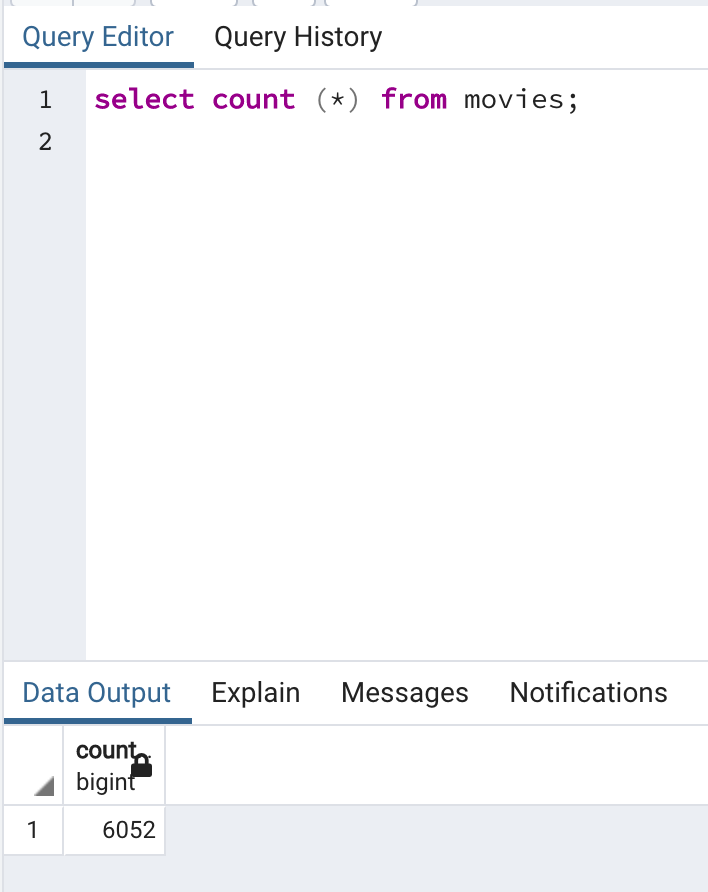
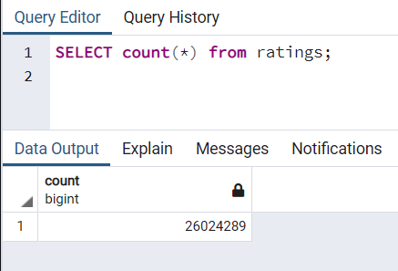

# Movies-ETL

#Overview
The purpose of this project was to perform an ETL (EXTRACT, TRANSFORM, and LOAD) process using  movie data retrieved from Wikipedia and Kaggle as well as  ratings data retrieved from Kaggle. The movies data from wikipedia was extracted in a JSON format while those from Kaggle in a csv format.

All three datasets were cleaned to get rid of redundant and duplicate columns and alsoe to make sure all data was presented in a consisted format.
As part of the transformation, the movie datasets from the two different sources were merged to create a movies dataframe. 

At the end the cleaned datasets were loaded to SQL as two tables, movies and ratings.

# Languages and tools used:
Jupyter Notebook,
Python,
PostgreSQL,
JSON, 
Pandas, 
NumPy, 
sqlalchemy, 
psycopg2

# Results.
1. A query was run to get the total number of rows for the movies dataset. A total of 6,052 rows.
select count (*) from movies;

2. A query was run to get the total number of rows for the ratings dataset. A total of 26,024,289 rows.
select count (*) from ratings;

